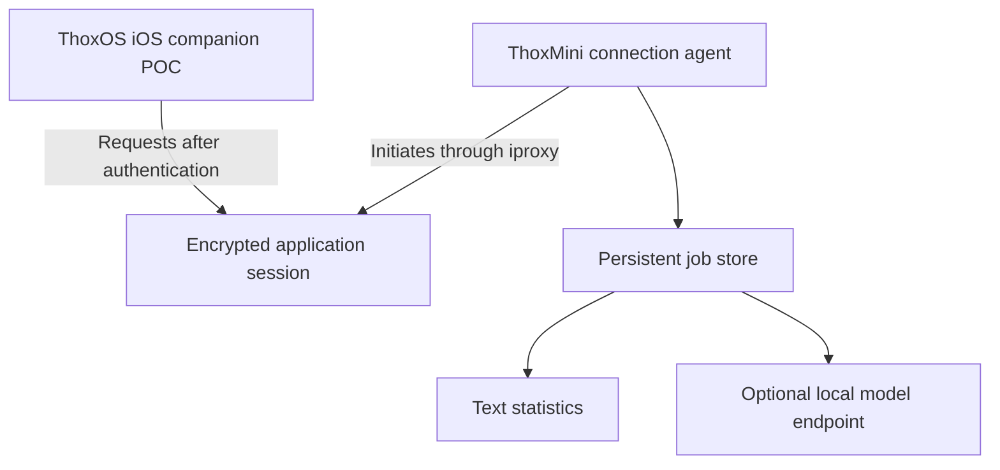

# THOX USB connection POC


An experimental fork of [libimobiledevice/usbmuxd](https://github.com/libimobiledevice/usbmuxd) with a THOX companion prototype under [`poc/`](poc/). It explores a wired workflow in which ThoxOS on iOS submits work to ThoxMini and retrieves persistent results.

**Delivery scope:** a Linux/Python connection agent, authenticated and encrypted application protocol, SQLite job storage, and a standalone SwiftUI iOS companion source project. The initial workload reports deterministic text statistics and a SHA-256 digest. An optional operator-configured local OpenAI-compatible endpoint can provide real inference when separately installed and qualified.

**Verified:** 34 Python tests, 11 native Swift tests, the Python CLI reconnect demo, and an unsigned iOS simulator build passed. See [recorded validation](poc/VALIDATION.md) for the tested commit and environment. Physical USB connectivity, phone compatibility, signed distribution, model performance, and existing ThoxOS integration remain unqualified.

**Continue the work:** [agent handoff hub](poc/handoffs/START_HERE.md) provides six assignments, kickoff prompts, owned paths, dependencies, and acceptance gates. The [task graph](poc/handoffs/tasks.json) tracks the remaining work; the [bench checklist](poc/docs/BENCH_VALIDATION.md) defines real-device evidence.

## Connection direction

ThoxMini is the USB host. Its connection agent opens a TCP connection through `iproxy` to a listener inside the foreground iOS app. Once authenticated, the iOS app submits requests over that connection and Mini sends responses.



`usbmuxd` provides transport to the iPhone; it does not automatically expose Mini's HTTP API to an iPhone client. The POC uses its own bidirectional application protocol. USBMux is an experimental dependency here; see [architecture and constraints](poc/docs/ARCHITECTURE.md).

## Build the standalone iOS companion

On a Mac with Xcode, build the included project:

```bash
xcodebuild -project poc/ios/ThoxUSBLab.xcodeproj \
  -scheme ThoxUSBLab \
  -destination 'generic/platform=iOS Simulator' \
  CODE_SIGNING_ALLOWED=NO build
```

The development bundle identifier is `ai.thox.thoxos.usblab`, separate from the existing ThoxOS app. For a real phone, open the project in Xcode, select an authorized development team and device, then build/install normally. A simulator build checks compilation; physical USB tests require the signed app on a phone.

In the companion, enter the standard-base64 32-byte pairing key, choose **Save key**, then **Start USB listener**. The listener uses `127.0.0.1:49321`. Keep the app in the foreground. Select a plain-text document of at most 65,536 UTF-8 bytes or enter text, then use the analysis/job controls after the connection is ready.

## Start on the Mini/Linux side

On a Debian/Raspberry Pi OS image with the listed packages available, run the following from a private operator terminal. The final command displays the new pairing key for manual import:

```bash
sudo apt update
sudo apt install usbmuxd libimobiledevice-utils libusbmuxd-tools python3-venv
python3 -m venv .venv
. .venv/bin/activate
python3 -m pip install -r poc/host/requirements.txt
PYTHONPATH=poc/host python3 -m thox_usb pair --output "$HOME/.config/thox-usb/pair.key" --reveal
```

Without `--reveal`, the pairing command prints only the key-file path. Provision the displayed base64 key into the companion app through its pairing UI. Keep it private. The same secret authenticates both ends and must never be committed, logged, or included in a bug report. This application pairing is distinct from Apple's device trust/pairing.

Connect the unlocked iPhone using a qualified data cable and correct USB host/power arrangement. Follow any system Trust prompt and keep the companion app in the foreground. Identify the exact connected device:

```bash
idevice_id -l
```

In one terminal, replace `YOUR_IPHONE_UDID` with the device you intend to connect:

```bash
iproxy -u YOUR_IPHONE_UDID 49322:49321
```

In a second terminal from the repository root:

```bash
. .venv/bin/activate
mkdir -m 700 -p "$HOME/thox-usb-workspace"
PYTHONPATH=poc/host python3 -m thox_usb bridge \
  --pair-key "$HOME/.config/thox-usb/pair.key" \
  --workspace "$HOME/thox-usb-workspace" \
  --host 127.0.0.1 \
  --port 49322
```

Use a dedicated workspace owned by the service operator. The host rejects a directory accessible by other users. `mkdir -m 700` applies to a new directory; for an existing dedicated directory, set its mode with `chmod 700 "$HOME/thox-usb-workspace"` before starting the bridge.

The forwarding listener must remain restricted to loopback. Do not enable a public `iproxy` bind. Check the installed `iproxy --help` if its option syntax differs. The explicit UDID prevents selecting another connected phone by accident.

Use the companion to check device status, submit text for analysis, and retrieve or cancel the returned job. Disconnect and reconnect to check that Mini retains the result. Full protocol and operation limits are specified in [`poc/PROTOCOL.md`](poc/PROTOCOL.md).

## Optional real inference

The default analysis mode does not run a language model. To enable inference, start and qualify a local compatible server on Mini, then add its fixed endpoint and model identifier to the bridge command:

```bash
PYTHONPATH=poc/host python3 -m thox_usb bridge \
  --pair-key "$HOME/.config/thox-usb/pair.key" \
  --workspace "$HOME/thox-usb-workspace" \
  --host 127.0.0.1 \
  --port 49322 \
  --inference-url http://127.0.0.1:8080/v1/chat/completions \
  --model YOUR_INSTALLED_MODEL_ID
```

The endpoint must use a literal loopback address; the iOS caller cannot override it. Model files, runtime installation, and model suitability are outside this fork. Storage capacity does not establish sufficient memory or acceptable inference speed.

## Validate locally

Run the actual Python bridge against a simulated iOS protocol peer, submit a
document, disconnect, and recover its result over a new encrypted connection:

```bash
python3 poc/scripts/demo.py
```

This demo uses loopback networking and a temporary private workspace. It does
not exercise usbmuxd, a phone, or a model. Then run the automated suite:

```bash
. .venv/bin/activate
PYTHONPATH=poc/host python3 -m unittest discover -s poc/tests -v
```

Local tests and build checks are run by an operator; GitHub Actions is disabled for this fork. A test result must record the command, environment, and tested commit. See [validation](poc/VALIDATION.md) for completed checks and [agent handoffs](poc/handoffs/START_HERE.md) for the remaining release gates.

## Project map

| Resource | Purpose |
|---|---|
| [`poc/handoffs/START_HERE.md`](poc/handoffs/START_HERE.md) | Coordinator instructions and six agent assignments |
| [`poc/handoffs/tasks.json`](poc/handoffs/tasks.json) | Machine-readable ownership, priorities and dependencies |
| [`poc/VALIDATION.md`](poc/VALIDATION.md) | Actual test/build outcomes and remaining limits |
| [`poc/PROTOCOL.md`](poc/PROTOCOL.md) | Framing, authentication, encryption, job operations |
| [`poc/ios/`](poc/ios/) | Standalone iOS source project and native build details |
| [`poc/docs/ARCHITECTURE.md`](poc/docs/ARCHITECTURE.md) | System boundaries, hardware roles, iOS constraints |
| [`poc/docs/BENCH_VALIDATION.md`](poc/docs/BENCH_VALIDATION.md) | Physical qualification checklist and evidence record |
| [`poc/docs/HANDOFF.md`](poc/docs/HANDOFF.md) | Build, integration, and operating handoff |
| [`ecosystem_map.md`](ecosystem_map.md) | Relationship to ThoxOS, MeshStack, and ThoxBeam |
| [`mvp_catalog.md`](mvp_catalog.md) | Proposed vertical slices and weighted priorities |
| [`development_queue.md`](development_queue.md) | Delivery state and next tasks |

## Upstream and licensing

The fork starts from upstream commit `3ded00c9985a5108cfc7591a309f9a23d57a8cba`. The original [upstream README](README.upstream.md) is preserved.

Upstream `usbmuxd` code and notices remain under their original licenses. THOX POC additions are GPL-3.0-or-later; this does not replace or relicense upstream files. Review the preserved upstream licensing files before redistribution. This fork is not affiliated with or endorsed by Apple or the libimobiledevice project.

© 2026 THOX.ai LLC. All rights reserved, subject to applicable licenses.  
THOX.ai™ and THOX product names and logos are trademarks of THOX.ai LLC.  
Other marks belong to their respective owners.

Your AI. Your Data. Your Rules.™
